<div align="center">

# MAJID ASGHARI

**Product Lead × AI × Systems**

Building intelligent systems, developer infrastructure & AI-native products.

*Designing and shipping systems where product thinking meets serious engineering.*

[](https://www.linkedin.com/in/majid-asghari)
[](https://github.com/MajidAsghariTabrizi)

</div>

---

<div align="center">

### Systems Map

<a href="systems-map.svg">

</a>

</div>

---

## Building in Public

<div align="center">

*Actively designing, building, and shipping systems — not just collecting commits.*

<br/>


</div>

---

## Selected Systems

<table>
<tr>
<td width="50%" valign="top">

### [Anti-Gravity Phoenix](https://github.com/MajidAsghariTabrizi/anti-gravity-phoenix-v4)

**Safety-first blockchain execution infrastructure.**

Fail-closed, AI-assisted financial system for Arbitrum. Three independent revenue lanes — Aave V3 liquidations, Atlas auction solving, and origin-aware DEX arbitrage. Dual-provider agreement, conservative economic gate, submission-unknown state machine, protected release lifecycle.

`Rust` `Solidity` `Go` `Python` `PostgreSQL` `NATS` `Docker`

[**→ View repository**](https://github.com/MajidAsghariTabrizi/anti-gravity-phoenix-v4)

</td>
<td width="50%" valign="top">

### [Free Best Router](https://github.com/MajidAsghariTabrizi/free-best-router)

**Intelligent routing for the free AI model ecosystem.**

One OpenAI-compatible endpoint that discovers, ranks, health-checks, and routes across OpenRouter, Groq, Cerebras, Mistral, DeepSeek and more. Capability-aware scoring, bounded failover, smart exploration.

`Node.js` `LLM Gateway` `Multi-Provider` `OpenAI-compatible`

[**→ View repository**](https://github.com/MajidAsghariTabrizi/free-best-router)

</td>
</tr>
<tr>
<td width="50%" valign="top">

### [Universal Engineering Agent](https://github.com/MajidAsghariTabrizi/universal-engineering-agent)

**Operating kernel for AI-assisted engineering workflows.**

Reference implementation of the UEA contract. Profile-agnostic, deterministic failure classification, staged verification, bounded recovery. Sibling to free-best-router.

`Node.js` `Operating Kernel` `Verification` `Failure Classification`

[**→ View repository**](https://github.com/MajidAsghariTabrizi/universal-engineering-agent)

</td>
<td width="50%" valign="top">

### [SmartTrader](https://github.com/MajidAsghariTabrizi/smart-trader)

**Decision intelligence for systematic market analysis.**

Algorithmic trading infrastructure built around deterministic evaluation, risk controls, and bounded execution logic.

`Python` `Trading Logic` `Market Data` `Risk Controls`

[**→ View repository**](https://github.com/MajidAsghariTabrizi/smart-trader)

</td>
</tr>
<tr>
<td width="50%" valign="top">

### [Felotin E-commerce](https://github.com/MajidAsghariTabrizi/felotin-ecommerce)

**Historical record — where it started.**

The original e-commerce build from 2020. Preserved as an authentic engineering artifact with its original Git history intact.

`PHP` `Product` `Web` `Historical`

[**→ View repository**](https://github.com/MajidAsghariTabrizi/felotin-ecommerce)

</td>
<td width="50%" valign="top">

### [Majid Systems](https://github.com/MajidAsghariTabrizi/majid-systems)

**Engineering portfolio — systems, products, and ideas.**

A living record of what I build. Updated as systems ship.

`TypeScript` `Portfolio` `Systems`

[**→ View repository**](https://github.com/MajidAsghariTabrizi/majid-systems)

</td>
</tr>
</table>

---

## Technical DNA

<table>
<tr>
<td width="33%" valign="top">

**AI & Intelligence**

`LLM Integration`
`Multi-Provider Routing`
`Capability-Aware Ranking`
`Autonomous Agents`
`DeepSeek Harness`
`OpenAI-compatible APIs`

</td>
<td width="33%" valign="top">

**Systems & Backend**

`Rust`
`Python`
`TypeScript`
`Solidity`
`Go`
`Node.js`

</td>
<td width="34%" valign="top">

**Infrastructure & DevOps**

`PostgreSQL`
`NATS JetStream`
`Docker`
`Linux`
`GitHub Actions`
`Prometheus`

</td>
</tr>
<tr>
<td width="33%" valign="top">

**Blockchain / Web3**

`Arbitrum`
`Aave V3`
`Foundry`
`Ethers.js`
`Uniswap V3`
`MEV Infrastructure`

</td>
<td width="33%" valign="top">

**Data & Analytics**

`Real-time Dashboards`
`Event Processing`
`Metabase`
`Kibana`
`PnL Reconciliation`
`Observability`

</td>
<td width="34%" valign="top">

**Product Engineering**

`Product Architecture`
`Developer Tools`
`Marketplace Systems`
`API Design`
`System Design`
`Open Source`

</td>
</tr>
</table>

---

## Engineering Direction

```text
Phoenix v4              — continuous protected LIVE hunting across three revenue lanes
Free Best Router        — v0.1.0 shipped, becoming the standard for free AI model routing
Universal Engineering   — v0.1.0 shipped, DSH ecosystem integration underway
LLM Tooling             — next-generation agent infrastructure for autonomous systems
```

The systems I build are designed to answer one question: **Is this opportunity still profitable after every known cost, execution constraint, and uncertainty reserve?**

No result is acted on unless every gate passes. A healthy production system can legitimately remain in a state where authority is available but no opportunity currently clears every threshold. That is correct behavior.

---

## Open Source

| Project | What it is | Status |
|---|---|---|
| [free-best-router](https://github.com/MajidAsghariTabrizi/free-best-router) | Intelligent router for free AI models — one endpoint, seven providers | v0.1.0 shipped · MIT |
| [universal-engineering-agent](https://github.com/MajidAsghariTabrizi/universal-engineering-agent) | Operating kernel for AI-assisted engineering | v0.1.0 shipped · MIT |
| [awesome-deepseek-harness](https://github.com/MajidAsghariTabrizi/awesome-deepseek-harness) | Curated DSH plugin ecosystem | Active |
| [awesome-deepseek-harness-plugins](https://github.com/MajidAsghariTabrizi/awesome-deepseek-harness-plugins) | 11,000+ DSH plugins with search API | Active |

---

<div align="center">

```
I build systems where many moving parts become one intelligent machine.
```

---

[](https://github.com/MajidAsghariTabrizi?tab=followers)
[](https://www.linkedin.com/in/majid-asghari)

</div>
