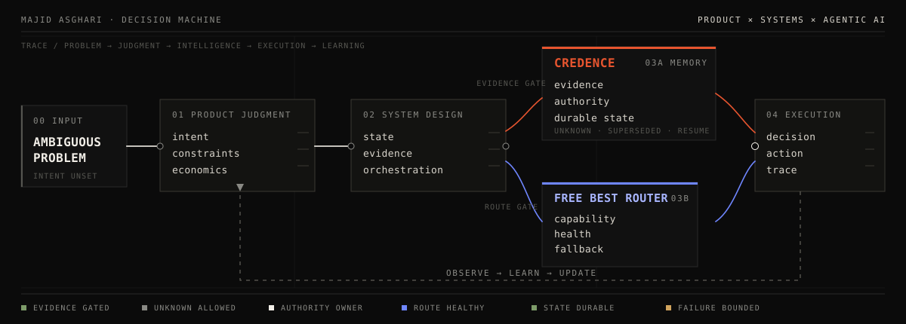
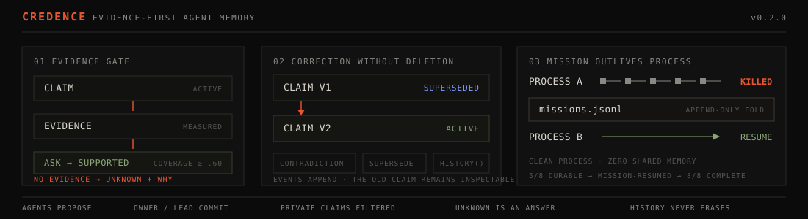
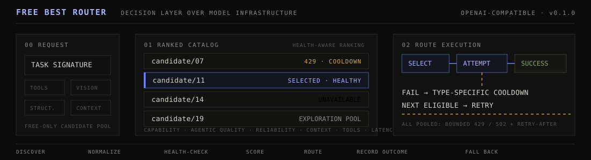

<div align="center">

# MAJID ASGHARI

**Product Lead → AI Systems Builder**

Building the infrastructure agents need to make evidence-backed decisions and execute reliably.



</div>

## Featured Open Source

### [Credence](https://github.com/MajidAsghariTabrizi/credence)



Evidence-first agent memory and durable mission runtime. Claims carry evidence, corrections supersede without deletion, and a clean process can resume a mission from an append-only log.

**[→ Repository](https://github.com/MajidAsghariTabrizi/credence)**

---

### [Free Best Router](https://github.com/MajidAsghariTabrizi/free-best-router)



One OpenAI-compatible decision layer over model infrastructure. It discovers, normalizes, health-checks, scores, and routes across free providers, with bounded failover and explicit recovery state.

**[→ Repository](https://github.com/MajidAsghariTabrizi/free-best-router)**

---

## The direction

```text
01 PRODUCT JUDGMENT        define intent, constraints, and economics before building.
02 SYSTEM DESIGN           make state, evidence, and orchestration explicit.
03 GOVERNED INTELLIGENCE   let evidence and routing act as control planes, not decoration.
04 RELIABLE EXECUTION      keep failure bounded, authority explicit, and learning durable.
```

I work where product leadership and AI systems engineering meet. My current focus is the infrastructure agents need to run beyond a single prompt: durable memory, governed learning, explicit unknowns, capability-aware routing, and recoverable execution.

---

## Product × Systems × Agentic AI

- [Credence](https://github.com/MajidAsghariTabrizi/credence) — evidence-first memory and durable missions
- [Free Best Router](https://github.com/MajidAsghariTabrizi/free-best-router) — model routing as a decision layer
- [LinkedIn](https://www.linkedin.com/in/majid-asghari)
